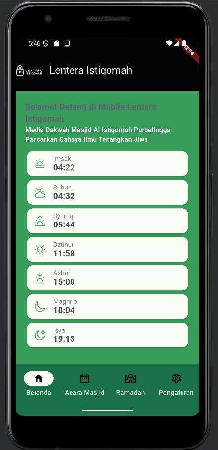
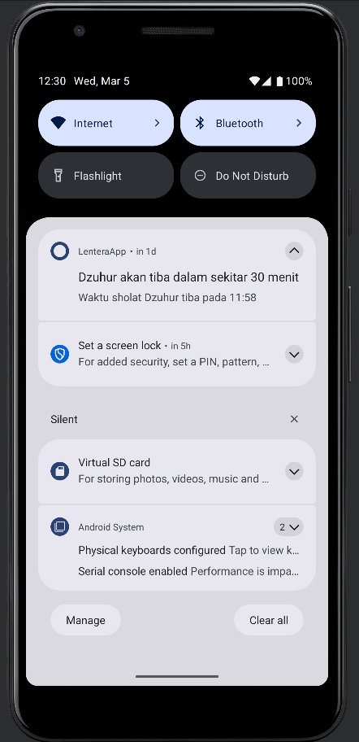
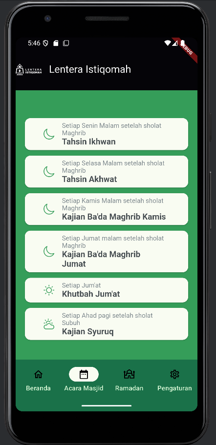
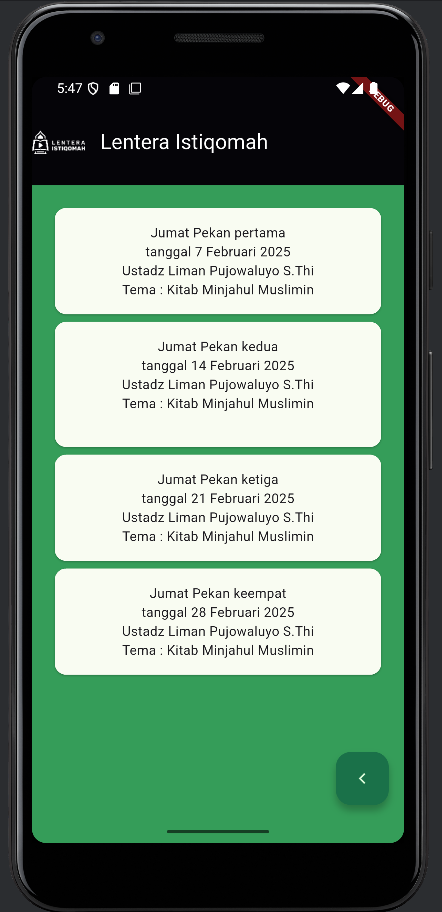
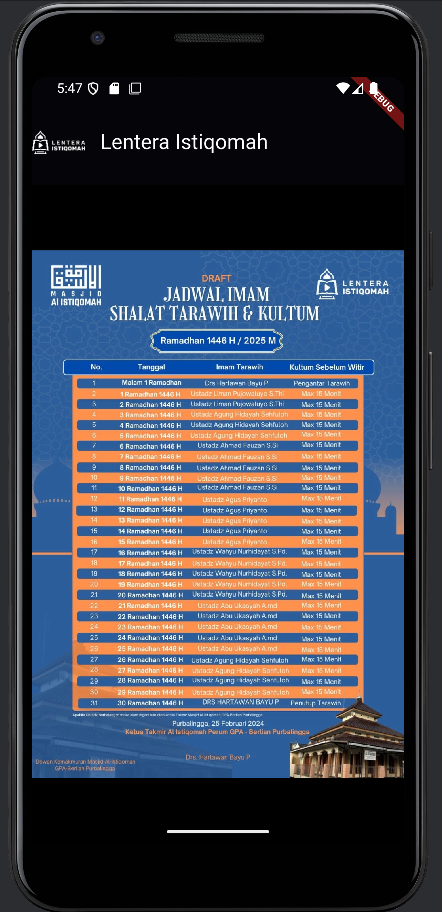
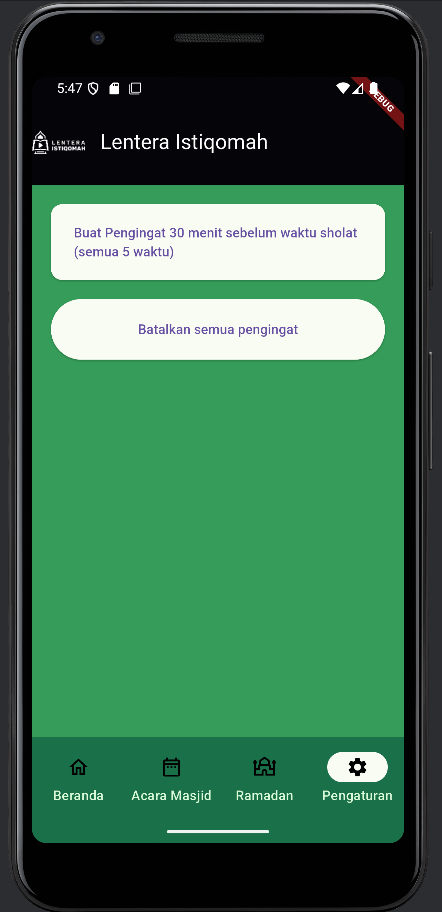

# Lentera Istiqomah

A Flutter application for Muslims, providing prayer times, event schedules, and notifications. This app serves as a digital platform for Masjid Al Istiqomah Purbalingga.

## Features

*   **Daily Prayer Times:** View accurate daily prayer schedules (Imsak, Subuh, Syuruq, Dzuhur, Ashar, Maghrib, Isya).
*   **Mosque Event Schedules:** Stay updated with various mosque activities and studies, including:
    *   Tahsin Ikhwan & Akhwat
    *   Kajian Ba'da Maghrib (Kamis & Jumat)
    *   Khutbah Jum'at details
    *   Kajian Syuruq
    *   Jadwal Imam Tarawih and Kultum during Ramadan.
*   **Prayer Reminders:** Set notifications for upcoming prayer times.

## Technologies Used

*   **Flutter:** For building the cross-platform mobile application.
*   **Dart:** The programming language used with Flutter.

## Screenshots

## Home Screen



## Notification Example



## Mosque Schedule Screen



## Study Theme



## Tarawih Screen



## Settings Screen




## Getting Started

### Prerequisites

*   Flutter SDK: [Install Flutter](https://flutter.dev/docs/get-started/install)
*   Dart SDK: (Comes with Flutter)

### Installation

1.  **Clone the repository:**
    ```bash
    git clone https://github.com/fadelfffar/muslim_project.git
    cd muslim_project
    ```
2.  **Install dependencies:**
    ```bash
    flutter pub get
    ```
3.  **Run the application:**
    ```bash
    flutter run
    ```

## Future Ideas

*   Qibla Compass
*   Quran Reader
*   Location-based Adhan Notifications
*   Integration with more community features.
